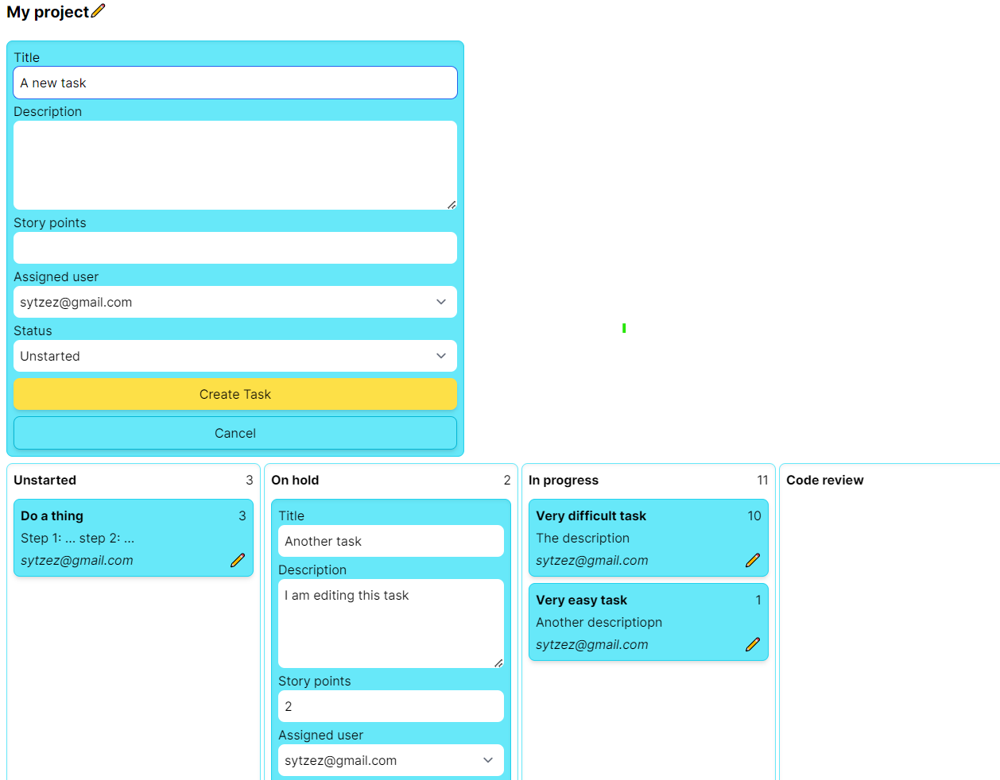

# Taskany

> Get more done with Taskany's project management tools

Taskany is a Jira/Trello/Clickup/etc. clone I built to try out Rails' Turbo functionalities.

## Features

- Create user accounts and sign in.
- Create projects.
  ([spec](/spec/features/projects_spec.rb))
- Create tasks in a project, with descriptions and story points, and assign them to users. 
  ([spec](/spec/features/tasks_spec.rb))
- Tasks go to different columns based on their status. Each column shows the sum of story points.
  ([spec](/spec/components/column_component_spec.rb))
- Live updates to the board when other people make changes.
- Functions with JavaScript disabled.

## Technologies used

`Rails` `Hotwire` `Slim` `TailwindCSS` `ViewComponent` `Devise` `Rspec` `FactoryBot`

## Code quality

- Rubocop: no offenses ([.rubocop.yml](.rubocop.yml))
- Rspec: 100% coverage ([coverage report](https://sytzez.github.io/taskany))

## Screenshot

## Data model

- User: a standard devise User
  ([model](/app/models/user.rb))
  - tasks: hasMany(Task)
- Project
  ([model](/app/models/project.rb),
  [controller](/app/controllers/projects_controller.rb))
  - title
  - tasks: hasMany(Task)
- Task
  ([model](/app/models/task.rb),
  [controller](/app/controllers/tasks_controller.rb))
  - project: belongsTo(Project)
  - assigned_user: belongsTo(User)
  - title
  - description
  - storyPoints
  - status: enum

## View components

- Board: shows a board, composed of columns for each status.
  ([component](/app/components/board_component.rb))
- Column: shows tasks for one status. Shows the total number of story points.
  ([component](/app/components/column_component.rb))
